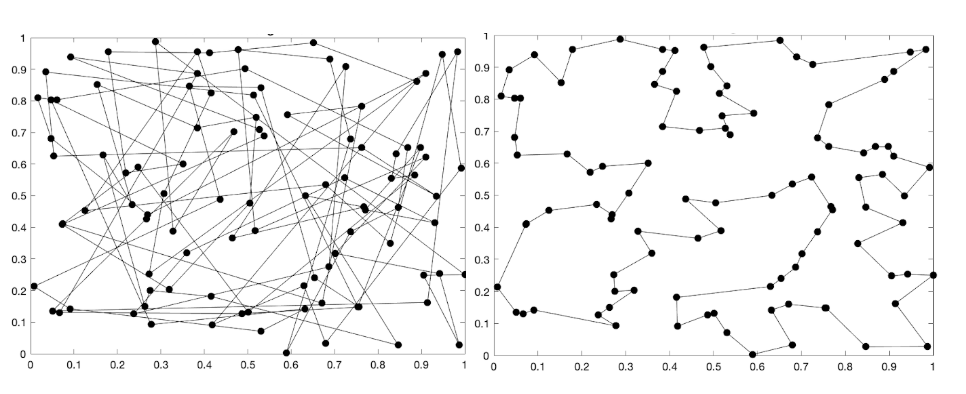

# Heuristic crossover for TSP.

Implementation of the heuristic crossover operator proposed by Vahdati et al. in [1]. The crossover is suppose to be used as part of the Genetic Algorithm Toolbox of the Department of Automatic Control and Systems Engineering of The University of Sheffield.

## Performance

The crossover operator, on the right, outperforms the basic implementation of the Alternating Edges Crossover(xalt), showed on the left, with the same parameter configuration in all of the cases considered by a large margin. The figure below is an example of the resulting tour with a relatively small number of population size and generations.

It also presents good performance on the benchmarks considered. For example, on the XQF131 problem tour lenghts of about 580kms can be obtained without proper hyperparameter tuning on short runs, close to the optimal tour of 564km.

## References

[1]	M. Y. M. P. a. M. B. N. S. G. Vahdati, "A New Approach to Solve Traveling Salesman Problem Using Genetic Algorithm Based on Heuristic Crossover and Mutation Operator," International Conference of Soft Computing and Pattern Recognition, pp. 112-116, 2009. 